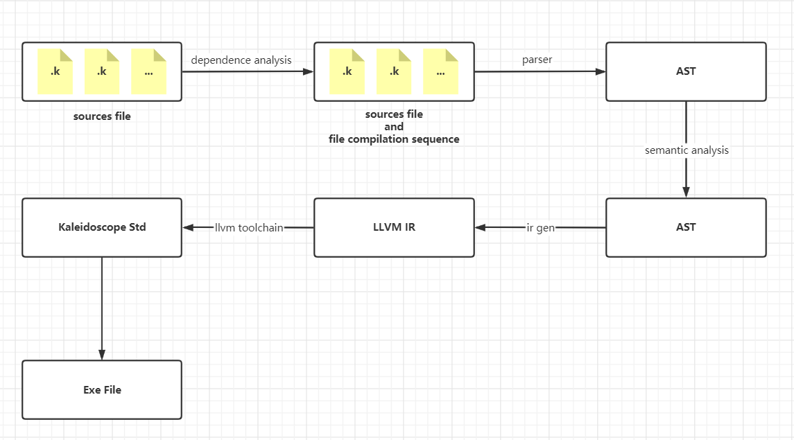

# Kaleidoscope  Compiler Project

[ZN](./README.zn.md)|[**EN**](./README.md)

## About Project

This project is a compiler project that implements a compiled language called **Kaleidoscope**. This language is introduced in the "LLVM Cookbook." Building upon the concepts explained in the book, this project extends the language with additional syntax and supports various types. It aims to create a brand new compiler for the Kaleidoscope language. The purpose of this project is to enhance skills in designing compilation systems and developing compilers. Everyone is welcome to contribute to expanding Kaleidoscope, including grammar, static analysis, optimizations, and other functionalities without limitations.

## Submission Guide

Format of commit message, each commit message has type. There are the following types.

```bash
git commit -m "<type> : message"
```

| Type     | Description                                                  |
| -------- | ------------------------------------------------------------ |
| feat     | Add new feature                                              |
| fix      | Fix bug                                                      |
| docs     | Add documentation                                            |
| style    | Changed the way the code is written (changes that do not affect how the code works) |
| refactor | Refactoring (code changes that are not new features or bug fixes) |
| perf     | Related to optimization, such as improving performance, experience. |
| test     | Add test case                                                |
| chore    | Changes to the build process or ancillary tools, such as add a new third party |
| revert   | Rollback to the previous version                             |
| merge    | Code merge                                                   |
| sync     | Bug synchronizing main line or branch                        |

## Grammar Definition

**Token**

```bash
ID, DEF, EXTERN, VOID, BOOL, CHAR, UCHAR, SHORT, USHORT, INT, UINT, LONG, ULONG, FLOAT, DOUBLE, LITERAL, INUMBER, FNUMBER, IF, FOR, WHILE, RETURN, BREAK, CONTINUE, STRUCT IMPORT CONST, IN, THEN, ELSE, COMMENT, SWITCH, CASE, DEFAULT
```

**Operator**

```bash
+ - * / = == != . > >= < <= ! >> >>> << <<< || && | & ^
```

**Operator Priority**

| Priority | Operator             |
| -------- | -------------------- |
| 1        | +a, -a, !a           |
| 2        | *, /                 |
| 3        | +, -                 |
| 4        | <<, <<<, >>, >>>     |
| 5        | <, <=, >, >=, ==, != |
| 6        | &, \|, ^             |
| 7        | &&, \|\|             |

**Grammar**

```bash
program : (varDef | funcDef | externDef | importDecl )* EOF

typeDecl : (VOID | CHAR | UCHAR | SHORT | USHORT | INT | UINT | LONG | ULONG | FLOAT | DOUBLE | BOOL)

externDef : (varExtern | funcExtern);

varExtern : EXTERN CONST? typeDecl ID ('['expr']')* ';'

funcExtern : EXTERN ID '(' paramList* ')' (':' typeDecl)? ';'

varDef : typeDecl ID ('['expr']')* ('=' initExpr)? ';'

initExpr : expr | '{' expr (',' (expr | initExpr) )* '}' 

funcDef : DEF ID '(' paramList* ')' (':' typeDecl)? blockStmt

importDecl : IMPORT LITERAL ';'

paramList : paramDecl (',' paramDecl)*

paramDecl : typeDecl (ID ('[' expr ']')* ('[' ']')? )?

stmt : (blockStmt | ifStmt | exprStmt | forStmt | whileStmt | returnStmt | breakStmt | continueStmt | switchStmt )

blockStmt : '{' stmt '}'

ifStmt : IF '(' expr ')' THEN stmt (ELSE stmt)?

exprStmt : expr ';'

forStmt : FOR '(' expr ';' expr ';' expr ')' IN stmt

whileStmt : WHILE '(' expr ')' stmt

returnStmt : RETURN expr? ';'

breakStmt : BREAK ';'

continueStmt : CONTINUE ';'

switchStmt SWITCH '(' expr ')' '{' caseStmt* default? '}'

caseStmt : CASE expr ':' stmt

default : DEFAULT ':' stmt

expr : logicExpr

logicExpr : bitExpr ('&&' | '||') bitExpr

bitExpr : cmpExpr ('&' | '|' | '^') cmpExpr

cmpExpr : bitMoveExpr ('>' | '>=' | '<' | '<=' | '==' | '!=') bitMoveExpr

bitMoveExpr : addExpr ('<<' | '<<<' | '>>' | '>>>') addExpr

addExpr : mulExpr ('+' | '-') mulExpr

mulExpr : unaryExpr ('*' | '/') unaryExpr

unaryExpr : ('+' | '-' | '!') primaryExpr

primaryExpr : '(' expr ')'
			| idRef
			| callExpr
			| constExpr
			
idRef : ID ('[' expr ']')*

callExpr : ID '(' (expr (',' expr)* )? ')'

constExpr : LITERAL
		  | FNUMBER
		  | INUMBER
		  | TRUE
	      | FALSE
```

## Test

## Compilation Process



## Build

Dependencies that the project needs

```bash
sudo apt install llvm-(10|12|14)
sudo apt install clang-(10|12|14)
sudo apt install cmake
```

Build project in Linux,` (Note: Currently the project only supports compilation for Linux)`

```bash
$> git clone https://github.com/zourenDevote/KaleidoscopeLanguage.git
$> cd KaleidoscopeLanguage
$> mkdir build && cd build
$> cmake ../
$> make -j 'nproc'

# test option
$> ctest -j 'nproc'
```

## Cmake Option

|      Option      |      Value       | Default Value |           Description            |
| :--------------: | :--------------: | :-----------: | :------------------------------: |
| CMAKE_BUILD_TYPE | Release \| Debug |    Release    | Release version or Debug version |

## Usage

```c
// helloworld.k
extern <kaldstd.k>

def main() : int {
    print("Hello,World!\n");
    return 0;
}
```

```bash
$>./Kaleidoscope helloworld.k -o hello
$>./hello
Hello,World!
```

